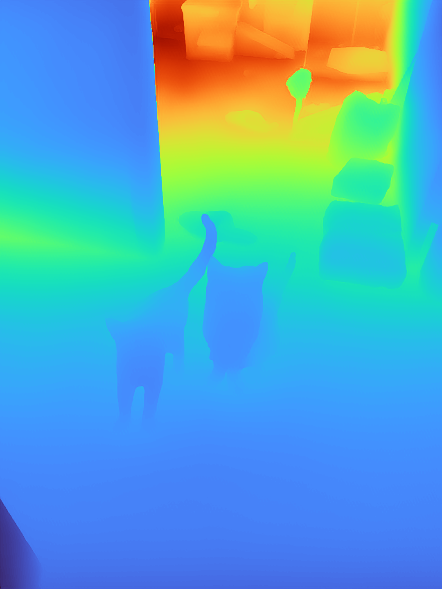
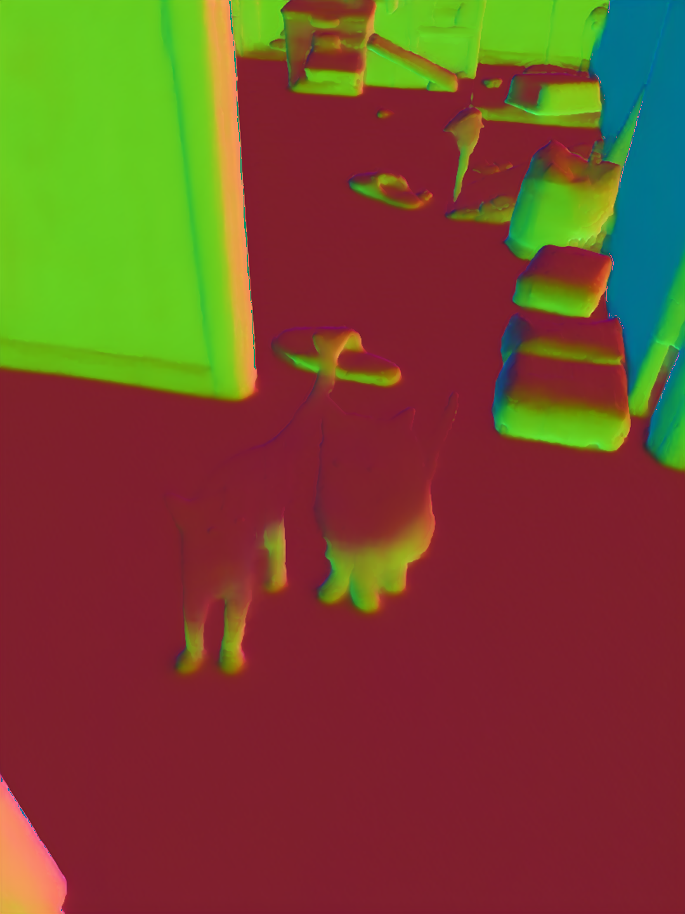

# Mini-Omnidata

Minimal repo for generating monocular geometric priors using [omnidata](https://omnidata.vision/). It simplifies the [original repo](https://github.com/EPFL-VILAB/omnidata/) for the inference purposes.

According to the [original repo's LICENSE](https://github.com/EPFL-VILAB/omnidata/blob/main/LICENSE), the usage of the omnidata dataset and the weights should only be of research purposes.

## Example
Our cats!
<div float="left">
  
  
  
</div>

## Differences to original repo
As the backbone is a vision transformer, image resolution should not be a hard constraint as long as they are multiples of 32. In contrast to only receiving 384x384 images in the original repo and [MonoSDF](https://niujinshuchong.github.io/monosdf/), we take arbitrary resolution images.
- If the resolution is multiple of 32, the image is directly fed to the network
- If not, the image is first resized to the nearest (height, width) that are multiples of 32 before being fed to the network. The output is resized back to the original resolution

If the image is too large and GPU memory explodes, you may use `down_factor` to down sample the input.

## Configuration
```
conda create --name omni python=3.8
conda activate omni
pip install -r requirements.txt

./download_weights.sh
```

## Inference
It takes both single images and folders of images. For the latter, png/jpg images will be globbed and processed.
```
python run.py --task depth --image_path /path/to/image.png
python run.py --task normal --image_path /path/to/images/
```

You may also visualize and save the output.
`--plt_vis` prompts plt windows. `--output_npy` stores outputs as they are for future usages. `--output_vis` saves colorized images only for the visualization purposes.
```
python run.py --task depth --image_path /path/to/image.png --plt_vis --output_npy depth_npy --output_vis depth_vis
```

## Postprocessing
For further tasks, you should only postprocess the stored npy file.
- Depths are unscaled. They should be either fed into networks that will deal with scales (e.g. [MonoSDF](https://niujinshuchong.github.io/monosdf/)), or re-scaled with other metrical priors.
- Normals are in [0, 1]. After loading, they need to be unnormalized to [-1, 1] by
```
normal = (normal - 0.5) * 2
```
followed by normalization.

